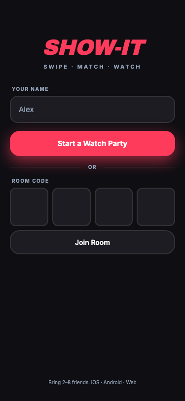

# Show-It

Tinder for movie night. Someone starts a Watch Party, shares a 4-digit code, and
everyone swipes through a shared stack of movies. The moment everyone swipes right
on the same title, it's a match and the app tells you where to watch it.



## Why it's built this way

It's an Expo (React Native) app, which means one codebase covers iOS, Android, and
a plain installable web app — no App Store fee needed to try it out. The backend is
Supabase (Postgres + Realtime), so there's no server to run or pay for; match
detection happens in a Postgres function so it's not racy between devices.

## Stack

- Expo (React Native + TypeScript) for the UI, navigation, and swipe gestures
- Supabase for room/member/swipe storage and Realtime sync
- TMDB for movie data, posters, streaming providers, and trailers
- react-native-reanimated + react-native-gesture-handler for the card deck

## Setup

### 1. Supabase

1. Create a free project at [supabase.com](https://supabase.com).
2. Open the SQL editor and run [`supabase/schema.sql`](supabase/schema.sql). This
   sets up `rooms`, `room_members`, `movie_pool`, `swipes`, `movie_cache`, the RLS
   policies, the realtime publication, and the `check_for_match` function.
3. Grab your Project URL and `anon` public key from Project Settings > API.

### 2. TMDB

1. Make an account at [themoviedb.org](https://www.themoviedb.org) and request an
   API key under Settings > API.
2. Either the v3 API key or the v4 read access token works — the app authenticates
   with whichever one you paste in.

### 3. Environment

```bash
cp .env.example .env
```

Fill in `EXPO_PUBLIC_SUPABASE_URL`, `EXPO_PUBLIC_SUPABASE_ANON_KEY`, and
`EXPO_PUBLIC_TMDB_API_KEY`.

## Running it

```bash
npm install
npm run web      # opens in the browser, works as an installable PWA
npm run ios      # needs Xcode / iOS Simulator
npm run android  # needs Android Studio / an emulator
```

To let someone else on the same WiFi try it, run `npx expo start` instead of
`npm run web` — that gives you a QR code and a LAN address they can hit from their
own phone or browser.

To ship the web build as a real installable PWA, export it (`npx expo export -p
web`) and drop the `dist/` folder on any static host — Vercel, Netlify, Cloudflare
Pages, GitHub Pages all work.

## How matching works

Swiping right upserts a row into `swipes` and calls `check_for_match`, a Postgres
function that checks whether every current room member has swiped right on that
movie. That check runs server-side rather than in the client, which avoids a race
where two people's phones both think they caused the match.

Every device in a room is subscribed to Postgres changes on `rooms`, `room_members`,
and `swipes` through Supabase Realtime, so when a room's status flips to `matched`,
everyone gets bounced to the match screen at the same time.

## Filters and caching

The host can narrow the pool by genre, streaming platform, and runtime before
swiping starts — those live in `rooms.filters` and sync to everyone in the lobby in
real time. TMDB responses (movie lists, provider lists, trailers) get cached in a
shared `movie_cache` table with TTLs ranging from a day to a week, so repeated
rooms with similar filters skip the external API call entirely.

## Known limitations

- No accounts — a room is just its 4-digit code, and each device gets a random ID
  stored locally. Fine for a group of friends, not something to build on for
  anything that needs real auth.
- Everything is scoped to the US region (streaming availability, provider list).
  Works fine if that's where you are; wrong otherwise.
- There's no way to leave a room from inside the app yet, and no cleanup job for
  old/abandoned rooms — they'll just sit in the database.
- Room codes aren't checked for collisions. Unlikely to matter until there's real
  traffic, but worth fixing before then.

## Later: real app store builds

If you want this on the actual App Store / Play Store instead of just the PWA, use
[EAS Build](https://docs.expo.dev/build/introduction/) — same codebase, no code
changes needed. You'll just need an Apple Developer account ($99/year) and a
Google Play developer account ($25 one-time).
